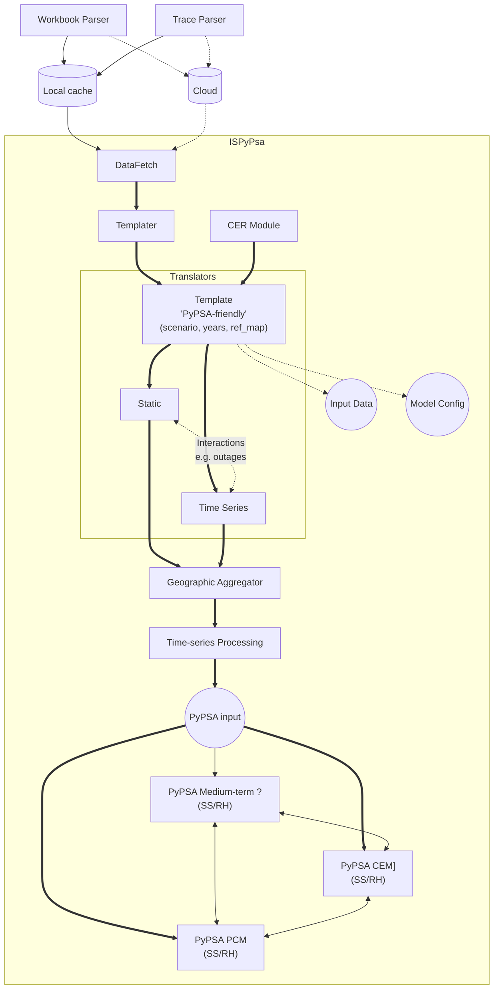

Updated 3/9/24

```mermaid
flowchart TD
    WorkbookParser[Workbook Parser] --> Cache
    WorkbookParser[Workbook Parser] .-> Cloud
    TraceParser[Trace Parser] --> Cache
    TraceParser[Trace Parser] .-> Cloud
    Cache[(Local cache)] --> DataFetch
    Cloud[(Cloud)] .-> DataFetch
    subgraph ISPyPsa
    DataFetch ==> Templater[Templater]
    Templater ==> Template["Template
    'PyPSA-friendly'
    (scenario, years, ref_map)"]
    CER[CER Module] ==> Template
    Template .-> Input((Input Data))
    Template .-> Config((Model Config))
    subgraph Translators
    Template ==> Static[Static]
    Template ==> TS[Time Series]
    Static <.->|Interactions
    e.g. outages| TS
    end
    Static ==> Aggregator[Geographic Aggregator]
    TS ==> Aggregator
    Aggregator ==> TSP[Time-series Processing]
    TSP ==> ModelData((PyPSA input))
    ModelData ==> CEM["PyPSA CEM]
    (SS/RH)"]
    ModelData ==> PCM["PyPSA PCM
    (SS/RH)"]
    ModelData --> MT["PyPSA Medium-term ?
    (SS/RH)"]
    MT <--> CEM
    MT <--> PCM
    CEM <--> PCM
    end
```